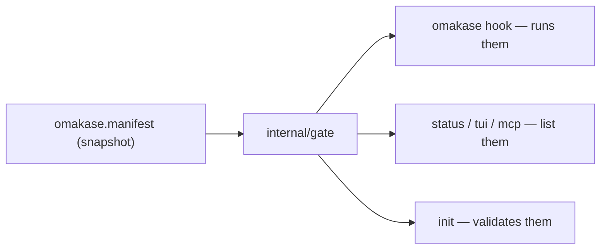

# Gate module: manifest-declared gates replace lefthook

**Status: design for review, 2026-07-15.** Locked decisions below; implementation has not
started. Supersedes the gate-wiring half of `docs/v2-design.md` where they disagree.

## Goal

Make "a gate" omakase's own concept, declared in `omakase.manifest` and run by the omakase
binary, so no part of the product knows any third-party runner's file format. Today six
places know lefthook's config format (init validation, hook runtime, `status/guards.go`,
`tui/gaterows.go`, `internal/lefthook`, `bin/lib-lefthook.sh`) — roughly 1,200 source lines
plus ~500 test lines that exist only because that knowledge leaked.

**Non-goals:** no change to what a gate can do, to the ledger format, to the dispatcher
hooks (#98), or to any consent/toggle behavior. No compatibility layer for old harnesses
(hard cut, see Migration). No Windows support change (gates were always shell).

## Locked decisions (2026-07-15)

1. **Schema** — gates are declared in `omakase.manifest`, not a separate file and not a
   directory convention.
2. **Authoring** — a gate is a plain script or command. The binary provides filtering,
   caching, audited skips, and ledger recording around it. `omakase-gate.sh` is deleted.
3. **Coexistence** — keep today's refusal: init does not install where another hook
   manager is present, now including repos whose project uses lefthook natively (today
   those get lefthook-specific cooperation; that code dies with the runner). The stock
   git-lfs hook forwarding stays. Generic hook chaining was considered and rejected as
   scope creep (2026-07-15); it stays severable — see "Deferred: hook chaining" below.
4. **Migration** — hard cut. The release that ships this reads manifest gates only; init on
   a harness that still ships `lefthook-local.yml` refuses with migration instructions.

## What the user sees change

| Surface | Before | After |
|---|---|---|
| a commit in a gated repo | gates run, fail blocks | identical (same scripts, same block) |
| authoring a harness | `lefthook-local.yml` of `run: omakase-gate.sh …` lines | `gate:` blocks in `omakase.manifest`; gates are plain scripts |
| skip everything once | `LEFTHOOK=0 git commit` | `OMAKASE_SKIP_GATES=1 git commit` (audited, printed) |
| skip one gate once | `OMAKASE_SKIP_<NAME>=1` | unchanged |
| init in a repo with existing hooks | refused (except native-lefthook repos, which get cooperation) | refused, native-lefthook repos included — the one regression, affecting no known install |
| init duration / trust | fetches + sha256-verifies a 3.4 MB lefthook binary per machine | nothing fetched beyond omakase itself |
| status / menu gate list | runs `lefthook dump`, pattern-matches output | reads the declaration directly |
| `git commit --no-verify` | bypasses everything | unchanged |

## Manifest schema

`omakase.manifest` stays a flat hand-parsed text file (no YAML library). Today it carries
`name:` and `version:`. A `gate:` line opens a block; indented `key: value` lines belong to
it until the next non-indented line.

```
name: starter-harness
version: 0.2.0

gate: block-marker
  hook: pre-commit
  run: gates/block-marker.sh

gate: go-test
  hook: pre-push
  run: gates/go-test.sh
  glob: *.go go.mod go.sum
  cacheable: true
```

| Key | Required | Meaning |
|---|---|---|
| `gate:` | yes | the gate's name: `[A-Za-z0-9._-]+`, unique within the manifest. The ledger/scorecard name and the `OMAKASE_SKIP_<NAME>` name (upper-cased, `.`/`-` → `_`) |
| `hook:` | yes | `pre-commit` or `pre-push` — the only stages omakase wires |
| `run:` | yes | a command line, executed via `sh -c` from the repo root |
| `glob:` | no | space-separated case patterns (a single `*` spans directories — same dialect as today). Gate runs only when a changed file in the range matches; absent = always in scope |
| `cacheable:` | no | `true`: a recorded PASS for the exact HEAD sha short-circuits the run |

**Validation at init (refuse = place nothing, unchanged invariant):** unknown keys, a
missing required key, a duplicate name, or a bad hook stage refuse the whole harness. If
`run:`'s first token is a path inside the harness (`gates/…`, `.omakase/…`), that file must
exist in the payload and be executable — the "nothing runs undeclared" check, moved from
the yml scan to the manifest. A first token that is not a payload path (e.g. `go`) is the
author's command and is accepted as-is.

**Which copy is read at hook time:** the manifest is read from the snapshot in the shared
zone (`.git/omakase/payload-snapshot`), written only by init. Editing the placed manifest in
the clone changes nothing until a bare `omakase init` re-consents to it. Gate *scripts* run
from the working copy, as they do today. This keeps the one-writer invariant on wiring: the
set of things that can run is fixed at init time.

## The gate module

One new package, `internal/gate`, owning the concept end to end. Everything below is a
direct port of `omakase-gate.sh`'s verified semantics (163 lines) into Go; the script is
then deleted.

```
gate.Load(omk string) ([]Gate, error)     // parse the snapshot manifest's gate blocks
gate.RunHook(hook string, io…) int        // run every gate declared for this stage
gate.Record(omk, name string) error       // out-of-band PASS for HEAD (deferred gates)
```

Per-gate run order, identical to the script:

1. **Audited skip** — `OMAKASE_SKIP_<NAME>=1` prints "skipped (audited)" and passes.
   New: `OMAKASE_SKIP_GATES=1` skips the whole stage the same visible way (replaces
   lefthook's `LEFTHOOK=0`).
2. **Menu skip** — a name listed in `.git/omakase/disabled-gates` (written by
   `omakase status`) skips visibly, persistent until re-enabled.
3. **Glob scope** — resolve a base ref (`origin/HEAD`, then `origin/master`, `origin/main`);
   diff `base...HEAD` (two-dot fallback for unrelated histories); skip only when no changed
   file matches. **No resolvable base = run unscoped** (#92: the threat model is omission).
4. **Cache** — `cacheable` + an existing `pass` row for this exact HEAD sha in
   `ledger.tsv` skips with "(cached)".
5. **Run** — `sh -c "<run>"` from the repo root with `GIT_DIR`/`GIT_WORK_TREE`/
   `GIT_COMMON_DIR` scrubbed (already done by `omakase hook`); append the verdict row;
   pass the exit code through unchanged. Any gate failing fails the stage.

**Ledger format unchanged:** `epoch \t name \t verdict \t sha`, append-only, in
`.git/omakase/ledger.tsv`. `probe.RunSummary` and the statusline already parse exactly
this; they do not change.

**Deferred gates** keep working: the pattern is `cacheable: true` plus a step that refuses;
the out-of-band PASS moves from `omakase-gate.sh <name> --record` to a plumbing verb,
`omakase record <name>` (fails loud on a write error, exactly like `--record` today).

Consumers all ask the module and never a runner:



`status/guards.go`'s dump-scraping and `tui/gaterows.go`'s duplicated copy of it are
deleted; both surfaces render `gate.Load` output. The declared/wired distinction disappears
because declaration *is* wiring.

## Hook time, before and after

```mermaid
flowchart TB
  subgraph B["BEFORE"]
    b1["git commit"] --> b2[".git/hooks/pre-commit (dispatcher)"]
    b2 --> b3["omakase hook pre-commit"]
    b3 --> b4["lefthook run (exec + parse yml)"]
    b4 --> b5["bash omakase-gate.sh per gate"]
    b5 --> b6["the check"]
  end
  subgraph A["AFTER"]
    a1["git commit"] --> a2[".git/hooks/pre-commit (dispatcher, unchanged)"]
    a2 --> a3["omakase hook pre-commit"]
    a3 --> a4["internal/gate: filter · cache · skip · record"]
    a4 --> a5["sh -c the check"]
  end
```



The dispatcher files and their fail-closed guard (#98) are untouched. The "pinned runner
missing" blocking point no longer exists — one fewer way a commit can block.

## Coexistence: the refusal stays

Init keeps refusing to install where another hook manager is present ("installing
omakase's hooks would displace the project's own"). Two changes:

- **Native-lefthook repos now refuse too.** Today the incumbent scan skips
  lefthook-mentioning hook files and `overlay/hook.go` runs the repo's own lefthook config
  through our pinned lefthook. That cooperation code dies with the runner, and installing
  over those hooks would silently disable the project's own gates — so these repos join
  the refusal list, with the same "if these are stale leftovers…" message. This is the
  design's one regression; no known install is affected (none of our repos use lefthook
  natively, and enterprise rulesets ban committed hook configs).
- **The stock git-lfs forwarding stays exactly as it is** — the incumbent scan keeps
  skipping stock git-lfs hooks and `omakase hook` keeps forwarding to `git lfs` at fire
  time. It is manager-neutral (git-lfs is not a hook manager) and already tested.

### Deferred: hook chaining

Generic chaining — preserve a pre-existing hook file as `<name>.before-omakase`, run it
after our gates, restore it on remove — was considered and rejected as scope creep
(2026-07-15). It would widen where omakase can install (repos with pre-commit stubs or
hand-written hooks are refused today and remain refused), at the cost of the design's only
new non-gate machinery. The decision is severable: everything it would touch is the
incumbent scan plus one call site in `omakase hook`. Revisit if a real install ever hits
the refusal.

## Deletions

| Deleted | Lines |
|---|---|
| `internal/lefthook/` (fetch, pin, resolve + tests) | 313 + 555 |
| `bin/lib-lefthook.sh` (the same fetch in shell) | 172 |
| `status/guards.go` dump-scraping + `tui/gaterows.go` duplicate | 322 + 159 (replaced by thin `gate.Load` rendering) |
| lefthook cooperation in `overlay/hook.go` (hasMain / hasLocal / `LEFTHOOK_CONFIG`); git-lfs forwarding STAYS | ~100 of 374 |
| `payload/.omakase/bin/omakase-gate.sh` | 163 sh |
| `payload/lefthook-local.yml` + starter-harness's | both |
| lefthook checksums, machine-cache dir, release re-pin chore for it | — |

Estimated: ~1,650 lines out (tests included), ~300–400 in (`internal/gate` + tests).

## Migration (hard cut)

- Ships as **v0.20.0** with the base payload and `examples/starter-harness` migrated in the
  same release. `pixterm-harness` and the work harness (`gim-home/yuncun/…`) each get a
  small follow-up PR: delete `lefthook-local.yml`, add `gate:` blocks; gates' scripts are
  unchanged except dropping the `omakase-gate.sh` wrapper invocation.
- Init on a harness that still ships `lefthook-local.yml` (or whose manifest declares no
  gates while a yml is present) refuses:
  `omakase: this harness declares gates in lefthook-local.yml, which omakase no longer
  reads. Declare them as gate: blocks in omakase.manifest (see <repo>/docs/) and delete the
  yml. Nothing was changed.`
- `omakase-gate.sh` was documented as a stability contract; this design retires that
  contract deliberately, with the refusal message as the migration pointer. All known
  consumers are ours.
- Repos already initialized keep working until their next `omakase init` (the dispatcher +
  new binary path reads the new snapshot); a bare re-init migrates them.

## Invariants: what changes, what holds

| | Before | After |
|---|---|---|
| blocking points | 5 (binary missing, runner missing, gate fails, init refusal, toggle refusal) | 4 — "runner missing" no longer exists |
| skip-all escape | `LEFTHOOK=0` | `OMAKASE_SKIP_GATES=1`, audited + printed |
| everything else in the fail-closed table | — | unchanged (`--no-verify`, `OMAKASE_SKIP_<NAME>`, bare init repair, remove) |
| one writer | init/remove write wiring | strengthened: gate list read from the init-written snapshot only |
| nothing runs undeclared | yml scan at init | manifest validation at init |
| green needs proof | probe tri-state | unchanged; `HooksInstalled` no longer has a runner to consider |
| zero committed footprint / exact undo | — | unchanged |

## Testing

- `internal/gate` table tests port each behavior of `omakase-gate.sh` one-for-one: skip
  env, disabled-gates, glob match/no-match, no-base-runs-unscoped (#92), unrelated-history
  fallback, cache hit/miss, verdict rows, exit-code passthrough, hostile names (tabs in
  name/sha), `record` failing loud.
- Ledger compatibility: rows written by the module are byte-identical in shape to the
  script's; `probe.RunSummary` tests run against module-written ledgers.
- Coexistence: native-lefthook repos refuse at init with the incumbent message; git-lfs
  forwarding regression tests unchanged.
- End-to-end: the repo's own starter-harness install (self-hosted since #108) proves a
  blocked commit live, as PR #108 did.

## Open review items

1. The plumbing verb name for the deferred-gate PASS: `omakase record <name>` (proposed).
2. The skip-all env name: `OMAKASE_SKIP_GATES=1` (proposed, consistent with per-gate skips).
